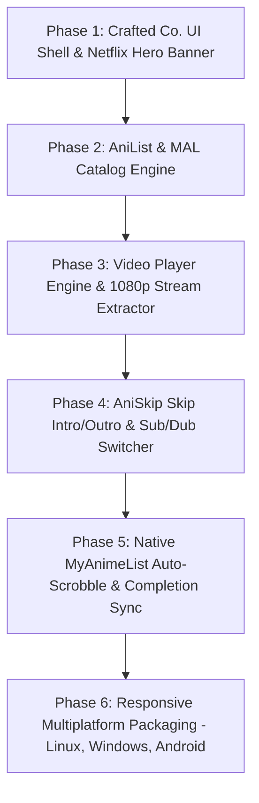

# Craftnime — Development Roadmap & Implementation Phases

This document details the multi-phase engineering plan for building **Craftnime**, from the Crafted Co. UI foundation to video streaming, AniSkip, and MyAnimeList auto-sync.

---

## 🗺️ Phase Breakdown

---

### 📦 Phase 1: Crafted Co. UI Shell & Netflix Hero Banner
* **Goal**: Build the signature Crafted Co. dark theme and responsive layout.
* **Deliverables**:
  1. **Design System**: Palette (`#1B1515` background, `#241E1E` cards, `#A9452D` rust accents, `Instrument Serif` + `Inter` typography).
  2. **Netflix Hero Billboard**: Cinematic header with trailer video integration, gradient vignettes, and quick play buttons.
  3. **Anime Carousels**: Smooth horizontal scrolling for *Trending*, *Top Airing*, and *Recent Episodes*.

---

### 📚 Phase 2: Catalog, Search & Metadata System
* **Goal**: Real-time anime discovery without user maintenance.
* **Deliverables**:
  1. **AniList GraphQL & Jikan API Client**: High-speed caching for search, genres, schedules, and seasonal charts.
  2. **Episode Matrix**: Clean episode grid with thumbnails, titles, and release dates.
  3. **Character & Relation Explorer**: Voice actor details, prequels, sequels, and OVA links.

---

### 🎬 Phase 3: Hardware-Accelerated Video Player
* **Goal**: Smooth, buffer-free 1080p streaming powered by the RTX 4060.
* **Deliverables**:
  1. **Stream Extractor Engine**: Multi-source HLS/MP4 streams with Sub/Dub availability.
  2. **Player Controls**: Custom Crafted Co. scrub bar, volume, fullscreen, keyboard shortcuts (`Space`, `F`, `M`, `Arrows`).
  3. **Auto-Next Episode**: Seamless queue and countdown overlay.

---

### ⚡ Phase 4: AniSkip (Skip Intro/Outro) & Subtitle Engine
* **Goal**: Zero-interruption watching experience.
* **Deliverables**:
  1. **AniSkip API Integration**: Automatic fetching of opening (OP) and ending (ED) timestamps.
  2. **Floating "Skip Intro" & "Skip Outro" Action Pill**: Appears automatically during theme songs.
  3. **Custom Subtitle Customizer**: Full control over font size, color, background box, and outline.

---

### 🏆 Phase 5: MyAnimeList (MAL) & AniList Auto-Tracker
* **Goal**: Zero manual list updating.
* **Deliverables**:
  1. **MAL OAuth2 Login**: Secure token storage and profile display.
  2. **Auto-Scrobbling**: Increments episode count automatically at 80% mark.
  3. **Auto-Completion**: Automatically marks anime status as **"Completed"** on MAL upon finishing the final episode.
  4. **Watchlist Hub**: *Currently Watching*, *Plan to Watch*, *Completed*, and *Dropped* categories.

---

### 📱 Phase 6: Multiplatform Optimization (Linux, Windows, Android)
* **Goal**: Deploy native apps to all devices.
* **Deliverables**:
  1. **Linux**: Native Wayland/X11 desktop client with hardware decoding.
  2. **Windows**: Native `.exe` build.
  3. **Android**: Native `.apk` with mobile touch gestures and PiP support.
